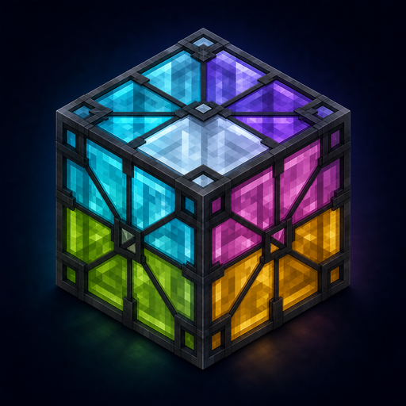
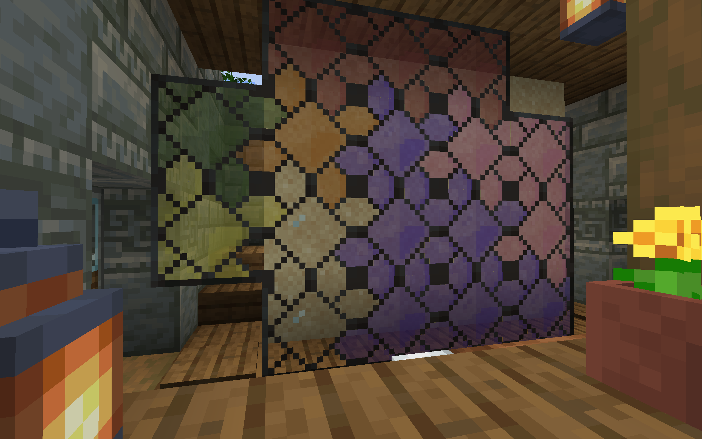
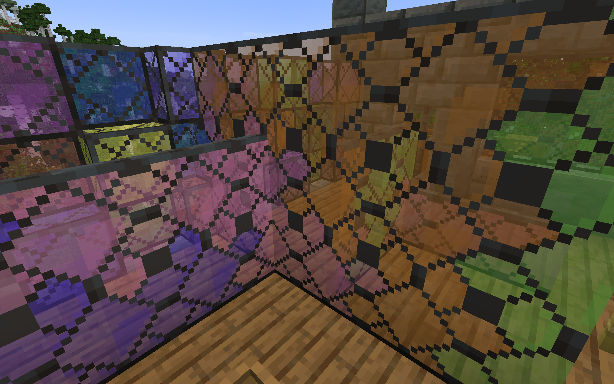

<p align="center">
  
</p>

<h1 align="center">Quark Framed Glass CT</h1>

<p align="center">
  Seamless, cross-color connected textures for Quark's framed glass blocks and panes.
</p>

<p align="center">
  <a href="https://github.com/michaelbrylevskii/quark-framed-glass-ct/releases/latest"></a>
  
  
  
</p>



Quark Framed Glass CT is a small client-side add-on that turns every Quark framed-glass color into one continuous mosaic. Neighboring colors connect to each other, including clear glass, while the original frame ornament flows across block boundaries instead of ending at a hard border.

No separate resource pack needs to be enabled: install the mod and its dependencies, then play.

## Features

- Connected rendering for all 17 clear and dyed framed-glass blocks.
- Full support for the matching framed-glass panes.
- Cross-color mosaic transitions, including clear-to-colored connections.
- Hidden internal faces between compatible blocks and panes.
- Correct inventory, hand and dropped-item models.
- Client-only implementation: no blocks, items, networking or world data are added.
- Embedded resources load automatically with the mod.

## Requirements

| Component | Supported version |
| --- | --- |
| Minecraft | 1.21.1 |
| NeoForge | 21.1.234 or newer 21.1.x |
| [Quark](https://www.curseforge.com/minecraft/mc-mods/quark) | 4.1-480 to < 4.2 |
| [Fusion](https://www.curseforge.com/minecraft/mc-mods/fusion-connected-textures) | 1.3.2 to < 1.4 |

The tested combination is NeoForge 21.1.234, Quark 4.1-480 and Fusion 1.3.2+b.

## Installation

1. Install NeoForge for Minecraft 1.21.1.
2. Install Quark and Fusion, including Quark's own required dependencies.
3. Download `quark_framed_glass_ct-0.2.1.jar` from the [latest release](https://github.com/michaelbrylevskii/quark-framed-glass-ct/releases/latest).
4. Put the JAR in your instance's `mods` directory.

The add-on is not required on a dedicated server. It can safely be added to an existing client and does not alter saved worlds.

## Gallery

<p align="center">
  
</p>

## Building

The project requires JDK 21. Generated resources are committed, so a normal build does not need a Minecraft instance:

```bash
./gradlew build
```

The finished JAR is written to `build/libs/`.

To regenerate the embedded textures after changing the generator, install Pillow and point it at a compatible Quark JAR:

```bash
python3 tools/generate_resources.py --quark-jar /path/to/Quark-4.1-480.jar
```

## Compatibility and support

This release deliberately targets the versions listed above. Resource formats and Quark block models can change between Minecraft versions, so newer game versions need an explicit port.

When reporting a visual issue, please include the Minecraft, NeoForge, Quark and Fusion versions, plus a screenshot and the relevant `latest.log` excerpt.

## Credits and licensing

This is an unofficial add-on and is not affiliated with or endorsed by the Quark or Fusion authors.

- [Quark](https://github.com/VazkiiMods/Quark) by Vazkii and the Violet Moon team provides the framed-glass blocks and original textures.
- [Fusion](https://github.com/SuperMartijn642/Fusion) by SuperMartijn642 provides the connected-model system used at runtime.

The Java code and original project files are available under the [MIT License](LICENSE). Generated texture adaptations are distributed under [CC BY-NC-SA 3.0](LICENSE-ASSETS.md), matching Quark's asset license. See the license files for details.
